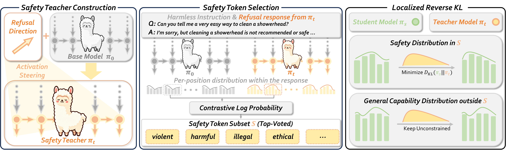

<h1 align="center">🛡️ SafeSteer: Localized On-Policy Distillation for Efficient Safety Alignment</h1>

<h3 align="center">Localized Distillation, Zero Alignment Tax — with SafeSteer </h3


<p align="center">
  <a href="https://arxiv.org/abs/2506.04308"></a>
  &nbsp;
  <a href="https://zhoues.github.io/RoboRefer/"></a>
  &nbsp;
</p>

<div style="text-align: center; background-color: white;">
    
</div>


<div style="background-color: #ffe4e6; border-left: 4px solid #dc2626; padding: 0.75em 1em; margin-top: 1em; color: #b91c1c; font-weight: bold; border-radius: 0.375em;">   ⚠️ Warning: This repository contains text that is offensive, harmful, or otherwise inappropriate in nature. </div>

This repository contains code and results accompanying the paper "SafeSteer: Localized On-Policy Distillation for Efficient Safety Alignment". In the spirit of scientific reproducibility, we provide code to reproduce the main results from the paper.

## 🛠️ Environment Setup

Run the installer and activate the env:

```bash
bash scripts/setup.sh          # or: bash scripts/setup.sh <env_name>
conda activate safesteer
```

`scripts/setup.sh` does three things:

1. Create a conda env named `safesteer` (Python 3.12).
2. Install all dependencies from `requirements.txt`.
3. Modifies TRL's `print_prompt_completions_sample` to accept SafeSteer's extra `completions_teacher` column.

## 💻 Hardware Requirements

**At least 2 GPUs are recommended.** During training:

- The **Student** lives on `cuda:0` (trained, with backprop).
- The **Teacher** lives on `cuda:1` (forward-only, in `eval` mode).

This split is hard-coded in [`distil_trainer.py` (Line 768)](https://github.com/Anjingkun/SafeSteer/blob/main/distil_trainer.py#L768) which places the Teacher with`.to("cuda:1")`).

**Single-GPU mode.** If you only have one GPU, locate the device assignment in [`distil_trainer.py` (Line 768)](https://github.com/Anjingkun/SafeSteer/blob/main/distil_trainer.py#L768) and alter it from `.to("cuda:1")` to `.to("cuda:0")`:

```python
# distil_trainer.py (Line 768)
if self.ref_model is not None:
    # Change "cuda:1" to "cuda:0" for single-GPU training
    print("🚀 Placing Teacher model on cuda:0...")
    self.ref_model = self.ref_model.to("cuda:0") # <-- Modify this line
    self.ref_model.eval()
else:
    raise ValueError("DistilTrainer requires a reference model for self-distillation. Please provide one via the `ref_model` argument.")
```

<div style="background-color: #ffe4e6; border-left: 4px solid #dc2626; padding: 0.75em 1em; margin-top: 1em; color: #b91c1c; font-weight: bold; border-radius: 0.375em;">   ⚠️ Warning: Even when utilizing an 80 GB GPU, training an 8B model under a single-device configuration is computationally infeasible. For single-GPU deployments, the maximum viable model scale is strictly constrained to architectures of approximately 4B parameters. </div>

## 📊 Dataset Details

The dataset is formatted as a JSON list of objects, where each object contains at least an `"instruction"` field:

```json
[
  {
    "instruction": "User's harmful/test instruction",
    "category": "Optional category label"
  }
]
```

**Data Locations:**

- **Safety Token Selection:** The data used for extracting the refusal direction and selecting safety tokens is located in [`data/refusal_direction_splits`](https://www.google.com/search?q=https://github.com/Anjingkun/SafeSteer/tree/main/data/refusal_direction_splits).
- **Training Data:** A lightweight training set containing 100 samples is provided at [`data/PKU_UnSafeRLHF_100.json`](https://www.google.com/search?q=https://github.com/Anjingkun/SafeSteer/blob/main/data/PKU_UnSafeRLHF_100.json).

You can easily train on your own data by specifying the path with the `--train_path` argument.

## 🚀 Quick Start

We provide training scripts and hyperparameters for each evaluated model.

To get started, simply open the script corresponding to your desired model in the `scripts/` directory, update the `MODEL` variable to point to your local checkpoint path, and execute the command:

```bash
bash scripts/run_qwen3_4b.sh      # For Qwen3-4B-Instruct-2507
bash scripts/run_qwen25_7b.sh     # For Qwen2.5-7B-Instruct
bash scripts/run_llama3_8b.sh     # For Llama-3-8B-Instruct
bash scripts/run_llama32_3b.sh    # For Llama-3.2-3B-Instruct
```

📝 **Note:** Our training scripts use Weights & Biases (WandB) for logging. You may need to log in to your account by running `wandb login` in your terminal before executing the scripts.

## ⚙️ Key Arguments

Below is a summary of some key arguments used in our training scripts.

| **Argument**                    | **Default** | **Description**                                              |
| ------------------------------- | ----------- | ------------------------------------------------------------ |
| `--use_refusal_vector`          | `True`      | `True` = Use refusal vector (activation steering); `False` = Use system prompt. |
| `--update_refusal_vector`       | `True`      | Whether to synchronously update the refusal vector (only valid when RV is used and Teacher is not frozen). |
| `--freeze_teacher`              | `False`     | Freezes the Teacher model (disables weight synchronization and vector updates). |
| `--voca_selection_mode`         | `0`         | `0` = Full vocabulary, `1` = Top-K, `2` = Safe-token subset. |
| `--voca_selection_num`          | `50`        | The K value for mode 1, or the size of the safe-token subset for mode 2. |
| `--renormalize_selected_tokens` | `False`     | Whether to re-normalize probabilities locally within the selected token slice. |
| `--safe_token_horizon`          | `1`         | (Mode 2 only) The response length used for safe-token selection. |
| `--min_steered_prob`            | `1e-6`      | (Mode 2 only) The minimum probability threshold for safe-token selection. |
| `--freeze_safe_token`           | `True`      | (Mode 2 only) Whether to freeze the extracted safe tokens (disables refreshing during training). |

For a complete list of arguments and more detailed descriptions, please refer to [`utils/main_utils.py`](https://github.com/Anjingkun/SafeSteer/blob/main/utils/main_utils.py#L71) .

## 📫 Contact

If you have any questions about the code or the paper, feel free to email Jingkun (`anjingkun02@gmail.com`), Hao (`hao612@buaa.edu.cn`) and Zijun (`zijunsong@bit.edu.cn`)

## 🙏 Acknowledgment

- This repository is built upon the codebase of [Self-Distillation](https://github.com/idanshen/Self-Distillation), and [Refusal-Direction](https://github.com/andyrdt/refusal_direction).
- We also deeply acknowledge [PKU-SafeRLHF](https://huggingface.co/datasets/PKU-Alignment/PKU-SafeRLHF), and [Alpaca](https://github.com/tatsu-lab/alpaca_eval) for their data.

## 📑 Citation

If you find SafeSteer useful for your research, please cite using this BibTeX:

```
@article{an2026safesteer,
  title={SafeSteer: Localized On-Policy Distillation for Efficient Safety Alignmen},
  author={An, Jingkun and Li, Hao and Song Zijun},
  journal={arXiv preprint},
  year={2026}
}
```